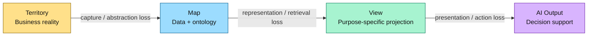
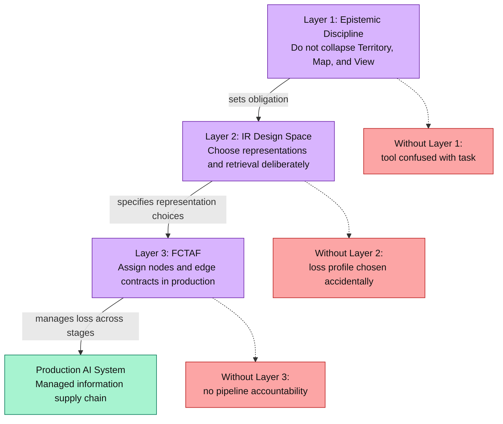
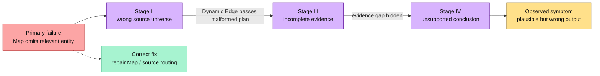
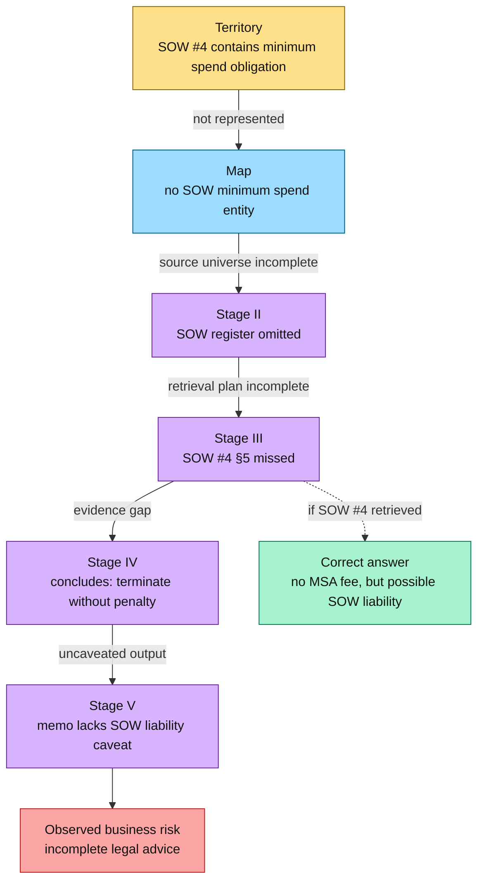

# Unified Theory of Epistemic Engineering

> **Validation status:** This is a synthesis framework, not an empirically validated causal model. Its value is diagnostic and architectural. Its predictive claims are noted in [Section 9](#9-open-claims--validation-status).

---

## 1. Core Thesis

AI implementation is not primarily a software problem. It is an **Epistemic Engineering** problem.

Software engineering asks: *can we build it?* Epistemic engineering asks: *do we know what we are building for?* Most AI systems that fail in production do not fail because the model is incapable or the code is broken. They fail because of mismatches between three things: the **Territory** (what the business reality actually is), the **Map** (how data represents that reality), and the **View** (what the AI projects as output).

When those three are out of alignment — when a representation is mistaken for the thing it represents, or when an output's scope is confused with the question it was designed to answer — the system produces outputs that are locally plausible but globally wrong.

---

## 2. Key Concepts: Territory, Map, View

These three terms are used precisely throughout this framework.

**Territory** — the raw reality of the domain: actual contracts, actual user behaviour, actual market dynamics. You never work directly with the Territory. Every tool, schema, and model works with a partial capture of it.

**Map** — the ontological commitment a team makes about what exists in the Territory: what counts as an entity, what properties it has, what relates to what. When an engineering team decides a "user" is a row with an email address and a timestamp, they have made an ontological commitment. These look like technical decisions because they are expressed in technical language; they are epistemic claims about what matters.

**View** — a deliberate, lossy projection of the Map for a specific purpose. A View is not merely a summary. It is a semantic commitment about what a particular reader, asking a particular question, should see — and, more importantly, should *not* see. The subway map hides distances, hills, and neighbourhoods to preserve only connection topology. The balance sheet hides most of the business to expose only financial position at a moment in time. Both are useful *because* of what they refuse to show.

**Key principle:** what a View hides is more important than what it shows. There is no neutral View. The structure of the loss is the craft.

### The Five View Types Used in This Framework

To avoid overloading the word "View," this framework distinguishes five specific types used in architectural diagnosis:

| View Type | What It Shows | What It Hides |
|---|---|---|
| **Functional View** | What happens (task supply chain, stages) | Which systems or actors execute it |
| **Logical View** | What exists (node types, actor assignments) | Which specific vendors or models are used |
| **Physical View** | What actual things are used (specific LLMs, APIs, stores) | The task structure and actor responsibilities |
| **Operational View** | How the system fits into a business function | The technical pipeline structure |
| **Behavioral View** | How the system reasons, transforms, or acts over representations across time | Implementation details and final presentation |

The most common architectural failure: collapsing the **Physical View** into the **Functional View** — mistaking "we are using GPT-4 for retrieval" for "we have solved the retrieval problem."

---

## 3. The Three-Layer Stack

This framework rests on three bodies of work. Each layer is not independent — each one constrains the one below it.

**Layer 1 — Epistemic Discipline** governs conceptual hygiene. It establishes the Commitment Scale: the obligation to keep Functional, Logical, and Physical views separate, and to acknowledge that every representation involves deliberate loss. Without this layer, teams conflate the tool with the task and cannot explain why a well-built system keeps producing wrong answers.

**Layer 2 — IR Design Space** provides the technical vocabulary for making representation decisions explicit. It maps the *Data Landscape* (structured, semi-structured, entropic) against the *Query Landscape* (Fact, Procedural, Analytical, Contextual) to specify which representation technique (Sparse, Dense, Graph, Summarised) and retrieval technique (Lexical, Semantic, Hybrid, Generative) is appropriate for the task. This layer turns the obligation from Layer 1 into a decision framework.

**Layer 3 — FCTAF** operationalises the pipeline. It breaks the task into five discrete stages, assigns Node types (AI, Code, Human) to each, and defines Edge contracts (Deterministic, Dynamic, Feedback) between stages. It provides the structure for managing information loss across the supply chain — and for diagnosing where losses escaped control.

### The Causal Chain

Layer 1 tells you **what not to collapse:** do not conflate the Map with the Territory; do not conflate the View with the Map.

Layer 2 tells you **how to represent:** given that every representation is a structured loss, which losses are acceptable? What representation preserves what the Query Landscape requires?

Layer 3 tells you **who manages each loss:** which Node type owns each stage, which Edges enforce contracts, and how a loss at one stage propagates into symptomatic failures at a later one.

Without Layer 1, teams cannot see where their representations are collapsing. Without Layer 2, they cannot choose representations deliberately. Without Layer 3, they cannot assign accountability for failures across the pipeline.

---

## 4. How Loss Propagates Through AI Systems

Every representation involves loss. That is not a problem to be solved — it is the fundamental condition of working with any real system. The engineering question is not *can we avoid loss?* but *can we control which losses we take and at which stages?*

Loss becomes dangerous when it is uncontrolled, unacknowledged, or propagated silently.

### Three Loss Failure Modes

**1. Structural Collapse** — layers that should remain separate get welded together. A dashboard is built directly against a schema designed for one specific question. When the question changes, the schema must change, which breaks the dashboard, forcing a rebuild of both. The system cannot evolve any one part without destabilising the rest.

**2. Silent Propagation** — a loss at an upstream stage passes through a Dynamic Edge undetected and presents as a symptom at a downstream stage. A Stage II failure (wrong knowledge source selected) produces irrelevant output at Stage III. The observer watching Stage III sees a retrieval failure. The root cause is one stage earlier. Dynamic edges increase the gap between primary and symptomatic failure because they allow malformed outputs to pass unchecked.

**3. Epistemic Collapse** — the team stops distinguishing the Territory from the Map. The schema is treated as the source of truth rather than as a partial model of it. When the Territory changes (new contract terms, new data sources, revised business logic), the team discovers they have been reasoning about the Map while the Territory drifted away.

### Loss as a Design Input

The IR Design Space provides vocabulary for specifying loss at the representation layer:

- A **Sparse representation** (BM25, TF-IDF) preserves lexical signal; it loses semantic relatedness.
- A **Dense representation** (embeddings) preserves semantic relatedness; it loses exact-term recall.
- A **Graph representation** preserves relational structure; it loses distributional properties.

Choosing a representation technique is a claim about which losses the downstream Query Landscape can tolerate. If the Query Landscape is Procedural (step-finding, instruction-following), semantic relatedness matters less than structural precision — a Graph or Hybrid representation. If the Query Landscape is Analytical (trend synthesis, comparison), semantic coverage matters more — Dense with reranking.

The deeper failure is not merely choosing the wrong technique. It is choosing without knowing what loss profile the task can tolerate.

---

## 5. Alignment with FCTAF

The three-layer stack maps to FCTAF's five stages. Each stage has an associated View type, an Epistemic Objective, and a Primary Metric with an operational definition.

```mermaid
flowchart LR
    S1["I. Intent Framing<br/>Metric: Legibility"]
    S2["II. Epistemic Mapping<br/>Metric: Identifiability"]
    S3["III. Info Retrieval<br/>Metric: Observability"]
    S4["IV. Logical Synthesis<br/>Metric: Faithfulness"]
    S5["V. Transduction<br/>Metric: Schema Conformance"]
    O["Actionable output<br/>final View"]

    S1 -->|"clarified intent"| S2
    S2 -->|"source plan"| S3
    S3 -->|"evidence objects"| S4
    S4 -->|"cited conclusion"| S5
    S5 --> O

    classDef stage fill:#D8B4FE,stroke:#6B21A8,color:#111111;
    classDef output fill:#A7F3D0,stroke:#047857,color:#111111;

    class S1,S2,S3,S4,S5 stage;
    class O output;
```

| FCTAF Stage | View Type | Epistemic Objective | Primary Metric | Operational Definition |
|---|---|---|---|---|
| **I. Intent Framing** | Operational | Define the target View | **Legibility** | The system's intent, scope, and constraints can be read and verified by an outside party before work begins. |
| **II. Epistemic Mapping** | Logical | Select the correct Framework | **Identifiability** | The relevant sources, schemas, and knowledge structures can be uniquely determined given the framed intent — ambiguity in source selection has been resolved. |
| **III. Info Retrieval** | Physical | Extract from the System | **Observability** | The retrieved evidence can be inspected to verify completeness and relevance; no material evidence gap is hidden from the downstream stage. |
| **IV. Logical Synthesis** | Behavioral | Reason over the Framework | **Faithfulness** | Every factual claim traces back to retrieved evidence, and every inferred claim is either supported by declared reasoning steps or explicitly marked as uncertain. |
| **V. Transduction** | Functional | Project the final View | **Schema Conformance** | The same structured input reliably produces output conforming to the same schema, citation rules, tone constraints, and presentation contract. |

### Stage-to-Layer Mapping

Each stage draws on a different layer of the stack:

- **Stages I–II** are where Epistemic Discipline (Layer 1) is most critical. Failures here are Map-level failures: wrong territory captured, wrong ontological commitment made.
- **Stage III** is where IR Design (Layer 2) is most critical. Failures here are representation or retrieval failures: wrong technique for the Query Landscape.
- **Layer 3 governs all five stages**, but becomes most visible at Stages IV–V, because synthesis and transduction failures expose whether node assignments and edge contracts were adequate throughout the pipeline.

---

## 6. Complexity Levers

Three dimensions define the difficulty profile of a task. They predict which stages are most at risk and which architecture choices are required.

| Lever | Layer Most Affected | Low | High |
|---|---|---|---|
| **Synthesis Depth** | Layer 3 / Stage IV | 1-hop: single API call | 5+ hops: multi-agent + structured decomposition |
| **Epistemic Friction** | Layer 2 / Stage III | Structured sources (SQL, clean JSON) | Entropic sources (scanned PDFs, inconsistent formats) |
| **Intent Variance** | Layer 1 / Stage I | Convergent: one correct answer | Divergent: many valid outputs, requires HITL |

High Synthesis Depth without a multi-stage architecture causes Stage IV hallucination. High Epistemic Friction without OCR normalisation, semantic chunking, and context optimisation causes Stage III retrieval incompleteness. High Intent Variance without human-in-the-loop at Stage I causes Ambiguity Drift that propagates silently through Stages II–V.

---

## 7. Diagnostic Protocol

To troubleshoot a failing AI system, work through these questions in order:

1. **Stage Location** — at which FCTAF stage is the symptom visible? Distinguish *symptomatic* failure (where the error appears) from *primary* failure (where it originated). Upstream failures routinely present as downstream symptoms.

2. **Node Assignment** — is the Node type (AI / Code / Human) appropriate for that stage's complexity? An AI Node at a stage that requires determinism fails silently. A Code Node at a stage that requires contextual judgment fails by design.

3. **Edge Contract** — is there a Dynamic Edge between the symptomatic stage and the one before it? If yes, a primary failure at the prior stage may have passed undetected. Consider replacing it with a Deterministic Edge and an output contract.

4. **Design Mismatch** — does the IR Technique (e.g., Dense / Semantic Search) match the Query Landscape (e.g., Procedural)? A mismatch here is a Layer 2 failure that is invisible to FCTAF-level inspection.

5. **Conceptual Collapse** — is the team confusing the Tool (Physical View) with the Task (Functional View)? If yes, fixing the model or the prompt will not fix the system.

6. **Layer Collapse** — has the Map been conflated with the Territory? Is the schema being treated as the source of truth? If yes, the system cannot adapt to Territory changes without a rebuild.

---

## 8. Worked Example: Legal AI Bot

Consider an AI system answering: *"Can we terminate the Acme vendor agreement without penalty?"*

This example shows how Territory / Map / View misalignment produces real failures at each FCTAF stage. The full pipeline design is documented in [examples/legal_ai_bot.md](examples/legal_ai_bot.md).

### Territory, Map, and View in This System

| | What It Is | Failure Mode |
|---|---|---|
| **Territory** | Actual contracts, amendments, SOWs, jurisdictional law, company risk policy as they exist | Missing documents, unsigned amendments not in the repository, outdated versions |
| **Map** | The contract data model: what counts as a "contract," an "amendment," a "clause," a "party" | "SOW minimum spend commitment" exists in the Territory but is not an entity in the ontology |
| **View** | The termination-risk analysis projected for a business user | Suppresses clause-level detail; retains risk rating, open questions, next steps |

### How Failures Manifest by Stage

**Stage I — Intent Framing (Legibility failure):** The system answers the right question for termination-for-convenience but the user meant termination-for-breach. The intent was not made legible before retrieval began. It presents as a wrong answer; the root cause is an underspecified View.

**Stage II — Epistemic Mapping (Identifiability failure):** The system queries the main contract repository but does not include the amendments index or the SOW register. The Map has an "amendment" entity but the source router does not identify it as relevant. The source universe was not uniquely determined given the framed intent.

**Stage III — Info Retrieval (Observability failure):** The system retrieves the termination clause (§12.2) and the fee waiver (Amendment 2, §3) but misses the SOW #4 minimum spend commitment. The retrieved evidence set was not inspectable for completeness before being passed downstream.

**Stage IV — Logical Synthesis (Faithfulness failure):** Working from incomplete evidence, the system concludes: *"you can terminate without penalty."* The correct answer is: *"without the MSA termination fee, but with potential SOW liability."* The conclusion extends beyond what the retrieved evidence supports.

**Stage V — Transduction (Schema Conformance failure):** The reasoning is correct, but the output has no citations, no risk rating, and no recommended next steps. A lawyer cannot act on it. The output schema was not enforced at the pipeline boundary.

### The Map-Level Root Cause

The Stage III and Stage IV failures share a common cause: the Map did not include "minimum spend obligation under SOW" as a first-class entity. It existed in the Territory (SOW #4, §5) but had no representation in the ontology. The retrieval system could not retrieve what the schema had no way to represent.

The immediate root cause is an **ontological omission**: the Map lacks a first-class representation for SOW minimum spend obligations. It escalates into a **Structural Collapse** when the system treats the termination-fee Map as sufficient for the broader termination-risk View — the View is locked to an incomplete Map, and neither can evolve without breaking the other.

---

## 9. Open Claims / Validation Status

The following table documents the epistemic status of each major claim. See [resources/grounding_assessment.md](resources/grounding_assessment.md) for the full assessment with citations.

| Claim | Status | Notes |
|---|---|---|
| Pipeline decomposition (5 stages) | ✅ Grounded | Consistent with Parasuraman (2000), Endsley (1995), CTA literature. Stage boundaries are novel. |
| Node taxonomy (Code / AI / Human) | ✅ Grounded | Simplified from Sheridan & Verplank (1978) automation levels. |
| Synthesis Depth as difficulty lever | ✅ Grounded | Wei et al. (2022) CoT evidence. Architecture mapping (1-hop → multi-agent) is novel. |
| Hallucination as Stage IV failure | ✅ Well-documented | RAGAS (Es 2023), Huang (2023). Upstream-cause framing is novel. |
| Edge taxonomy (Deterministic / Dynamic / Feedback) | ⚠️ Theoretical | Novel. No direct prior art on propagation-risk classification of inter-stage edges. |
| Epistemic Friction as lever | ⚠️ Theoretical | Grounded in Pirolli & Card (1999). AI-specific cost mapping unvalidated. |
| Stage I–II failures dominate production | 🔴 Speculative | Plausible from RAG literature (Gao 2023) but no systematic production study exists. |
| Territory / Map / View failure taxonomy | 🔴 Novel | Synthesised from `building_is_cheap` and `map_is_not_territory`. No direct prior art. |

**What would validate the framework:** A large-scale study of production AI system failures categorised by FCTAF stage, with edge-type annotations and ground-truth source labels.

---

*References: [map\_is\_not\_territory: building\_is\_cheap](../../map_is_not_territory/building_is_cheap.md) · [IR Design Space](../../information_retreival/Design%20Space.md) · [FCTAF v2](fctaf.md) · [epistemic\_architecture](epistemic_architecture.md) · [system-properties-glossary](../../map_is_not_territory/system-properties-glossary.md) · [legal\_ai\_bot example](examples/legal_ai_bot.md) · [grounding\_assessment](resources/grounding_assessment.md)*
